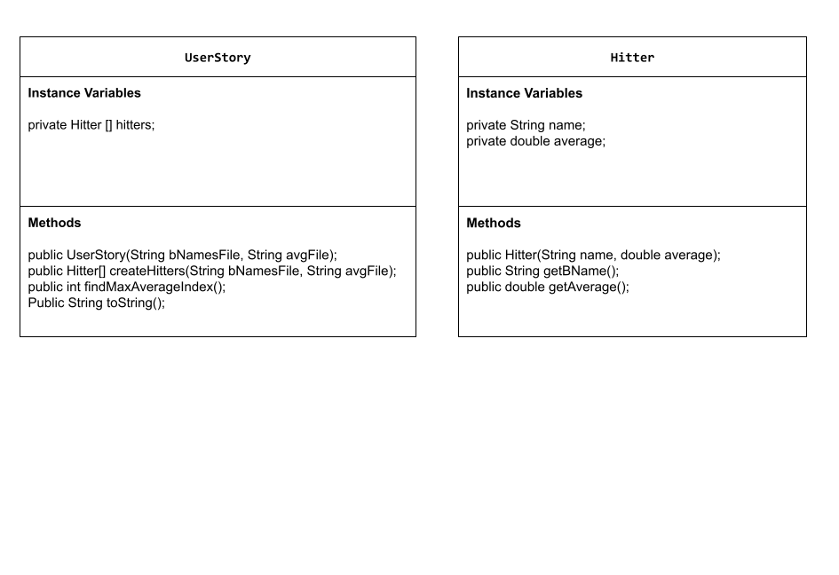

# Unit 3 - Data for Social Good Project

## Introduction

Software engineers develop programs to work with data and provide information to a user. Each user has different needs based on the information they are looking for from data. Your goal is to create a data analysis program for your user that stores and analyzes data to provide the information they need.

## Requirements

Use your knowledge of object-oriented programming, one-dimensional (1D) arrays, and algorithms to create your data analysis program:
- **Write a class** – Write a class to represent your user or business and store and analyze their data with no-argument and parameterized constructors.
- **Create at least two 1D arrays** – Create at least two 1D arrays to store the data that your user needs information about.
- **Write a method** – Write a method that finds or manipulates the elements in a 1D array to provide the information your user needs.
- **Implement a toString() method** – Write a toString() method that returns general information about the data (for example, number of values in the dataset).
- **Document your code** – Use comments to explain the purpose of the methods and code segments and note any preconditions and postconditions.

## User Story 

As a baseball enthusiast, I want to analyze certain baseball stats to see who was the best hitter in the 2025 regular season.

## Dataset 

Data Set: https://www.espn.com/mlb/stats/player/_/season/2025/seasontype/2 
- **NAME** (String) - name of the player.
- **AVG** (double) - batting average of a player.

## UML Diagram 

 

## Description 

This project adresses the user goal by being able to quickly identify which hitter has the highest batting average in a baseball dataset. The primary objective of this program is to find the maximum or highest batting average in a list and then use its index to receive the corresponding string of the player's name. The project uses two txt files, one to contain player names (batters.txt) and one to contain batting averages (battingAvg.txt). In these two arrays, the data at a specific index matches the data in the other array. The project has three classes, the Hitter class which serves as the object model for a player, the UserStory class which contains the necessary code to meet the user's goal, including the createHitters method which reads the data, findMaxAverageIndex method which uses an iterative algorithm to return the variable maxIndex which is equal to the index for the highest batting average, and finally the toString method which uses the returned maxIndex to acess the corresponding hitter object, and then the DataRunner class which acts as a tester class for the program. 
